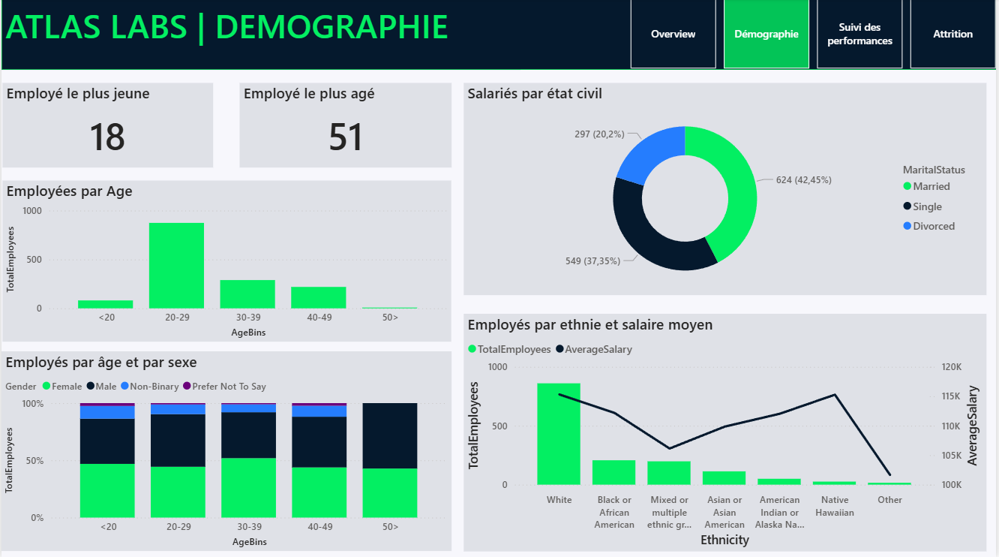
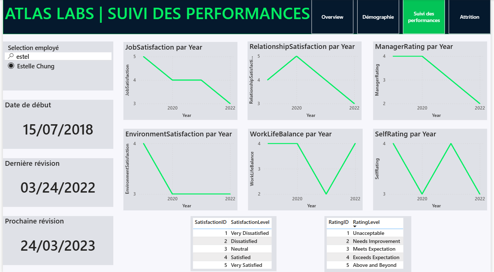
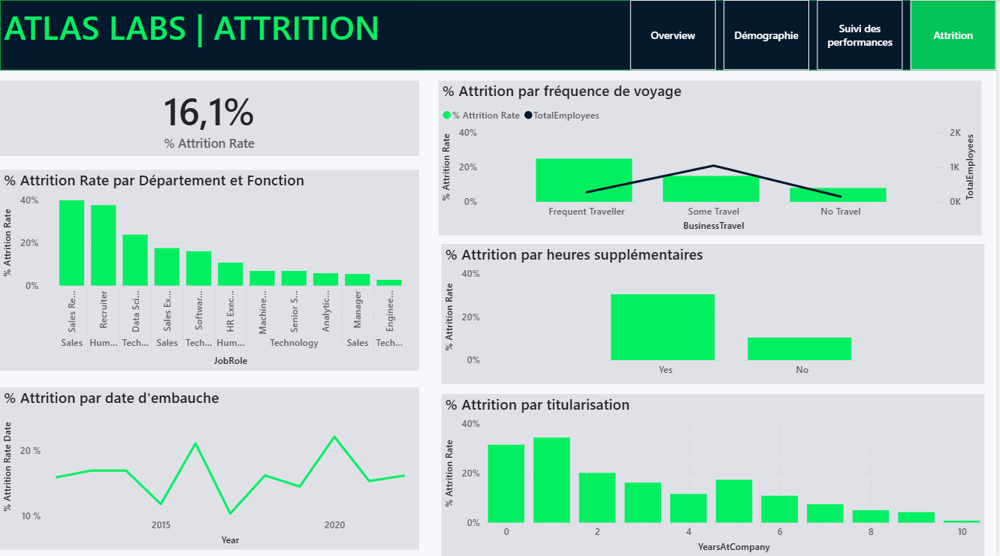

# Atlas Labs | HR Analytics Dashboard 📊

Tableau de bord RH interactif développé sous Power BI pour suivre les effectifs, analyser l'attrition et piloter les performances des employés chez Atlas Labs.

---

## 🎯 Objectif

Ce projet vise à fournir aux équipes RH une vision claire et actionnable de leurs données employés afin de :

- Suivre l'évolution des effectifs dans le temps
- Identifier et comprendre les facteurs d'attrition
- Analyser la répartition des employés par département et poste
- Piloter les performances et la démographie des équipes

---

## 📸 Aperçu

---

## 🛠️ Outils & Technologies

| Outil | Usage |
|---|---|
| Power BI | Conception du dashboard et visualisations |
| DAX | Calcul des KPIs (attrition rate, effectifs actifs/inactifs) |
| Power Query | Nettoyage et transformation des données |

---

## 📊 Contenu du Dashboard

Le rapport est structuré en 4 pages :

**1. Overview**
- KPIs globaux : 1 470 employés totaux, 1 233 actifs, 237 inactifs, 16,1% de taux d'attrition
- Tendances de recrutement de 2012 à 2022 avec segmentation attrition/rétention
- Répartition des employés actifs par département (Technology, Sales, Human Resources)
- Détail par département et rôle métier (Software Engineer, Data Scientist, Sales Executive...)

**2. Démographie**
- Analyse de la composition des effectifs par profil

**3. Suivi des performances**
- Indicateurs de performance individuelle et collective

**4. Attrition**
- Identification des facteurs clés de départ
- Segmentation par département, ancienneté et poste

---

## 💡 Insights clés

- Le département Technology concentre la majorité des effectifs actifs
- Le taux d'attrition global de 16,1% représente 237 employés inactifs sur 1 470
- Les tendances de recrutement montrent une croissance des effectifs entre 2017 et 2022

---

## 📁 Fichiers

| Fichier | Description |
|---|---|
| `Atlas_Labs_HR.pbix` | Fichier Power BI complet |
| `overview.png` | Capture d'écran de la page Overview |
