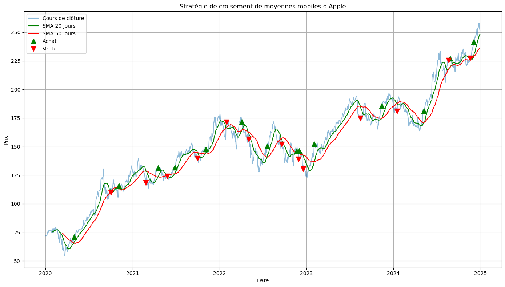

# 📊   Projet 1: Analyse des ventes sous Excel

## 🎯 Objectif
Ce projet vise à suivre les performances des ventes par région et catégorie pour identifier les zones à améliorer:
- Comprendre la répartition des performances régionales
- Identifier les régions avec un fort impact
- Fournir des recommandations pour l’amélioration des ventes

## 🗂 Données
- **Source Sales analysis** : [Superstore Dataset(Kaggle)](https://www.kaggle.com/datasets/vivek468/superstore-dataset-final)

## 📈Aperçu

---
  

# 📊 Projet 2: Analyse des performances des employés (HR Analytics) avec Python

## 🎯 Objectif
Ce projet vise à explorer les performances des employés afin de :
- Comprendre la répartition des scores de performance
- Identifier les outliers
- Étudier les relations entre performance et variables (heures travaillées, âge, etc.)
- Fournir des recommandations pour l’amélioration RH

## 🗂 Données
- **Source HR Analysis** : [HR Analytics Dataset (Kaggle)](https://www.kaggle.com/datasets/rhuebner/human-resources-data-set)

-----

# 📊Projet 3: Analyse des données financières d'Apple (AAPL) et Application du Machine Learning 

## Objectif

Ce projet vise à exploiter les données financières d'Apple pour générer des insights stratégiques et des recommandations d'investissement ciblées. À travers un processus analytique complet — extraction et traitement des données de marché, analyse quantitative de performance, et déploiement d'algorithmes de machine learning — nous développerons des modèles prédictifs robustes et des stratégies de trading algorithmique optimisées, transformant ainsi l'information brute en intelligence décisionnelle actionnable.

### 1. Analyse Exploratoire des Données (EDA)
- Collecter et nettoyer les données historiques du cours d'Apple (AAPL)
- Visualiser les rendements
- Visualiser l'évolution du prix, du volume et de la volatilité
- Analyser les statistiques descriptives (moyenne, écart-type, distribution)

### 2. Feature Engineering
- Créer des indicateurs techniques : 
  - Moyennes mobiles (SMA, EMA)
  - RSI (Relative Strength Index)
  - MACD (Moving Average Convergence Divergence)
  - OBV (On Balance Volume)
  - A/D Line (Indicateur d'accumulation et de distribution)
  - CMF (Chaikin Money Flow)
- Générer des features temporelles (jour de la semaine, mois, trimestre)
- Calculer les returns et log-returns

### 3. Backtesting et mesure de performance
- Implémenter une stratégie de Backtesting
- Mesurer les performances de la stratégiegies 

### 4. Modélisation Prédictive
**Objectif principal :** Prédire le prix de clôture d'Apple

#### Modèles à tester :
- Random Forest Regressor
- XGBoost

### 5. Évaluation et Comparaison
- Comparer les performances des modèles avec :
  - RMSE (Root Mean Squared Error)
  - MAE (Mean Absolute Error)
  - R² Score

### 6. Visualisation et Communication
- Créer des graphiques interactifs (Plotly)
- Visualiser les prédictions vs valeurs réelles
- Dashboard des métriques de performance

## 🗂 Données
- **APPL** : télécharger les données d'apple grâce à la bibliothèque yfinance

-----

# 📊 Projet 4: Analyse des facteurs de performances commerciales  avec Python

## 🎯 Objectif
Ce projet vise à explorer les facteurs qui influencent les performances des employés afin de:
- Comprendre les interactions entre les produits
- comprendre les performances régionales et les marges

## 🗂 Données
- **Source Sales analysis** : [Superstore Dataset(Kaggle)](https://www.kaggle.com/datasets/vivek468/superstore-dataset-final)
- *Coming soon...*

  

## ​About me
Je suis une data analyst passionnée par la transformation de données brutes en informations pertinentes. Mes compétences incluent SQL, Python, le machine learning et la visualisation de données avec Excel, Power BI, Tableau.
