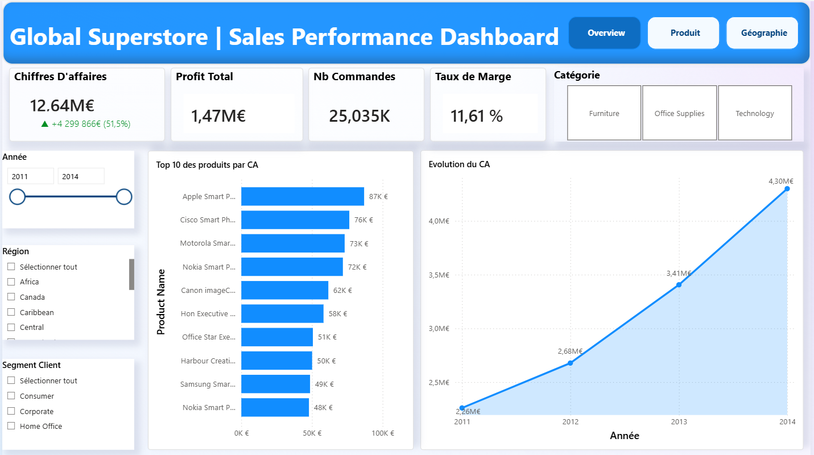
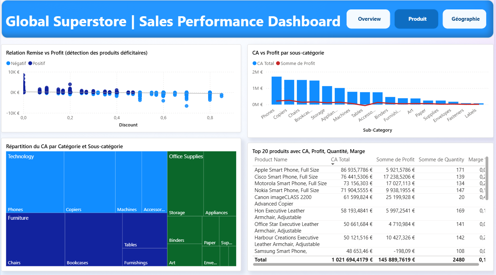
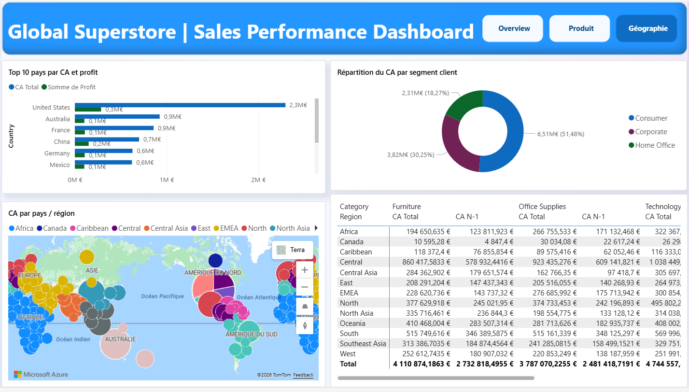

# Global Superstore | Sales Performance Dashboard 

Tableau de bord commercial interactif développé sous Power BI pour piloter les performances de ventes d'une entreprise internationale de distribution en temps réel.

---

## Objectif

Ce projet répond à une problématique métier concrète : permettre aux équipes dirigeantes et commerciales de visualiser rapidement les KPIs clés, les tendances de ventes et les performances régionales, sans manipuler des fichiers Excel complexes.

---

##  Aperçu

### Page 1 — Vue d'ensemble

### Page 2 — Analyse Produit

### Page 3 — Analyse Géographique

---

##  Outils & Technologies

| Outil | Usage |
|---|---|
| Power BI | Conception du dashboard et visualisations |
| DAX | Calcul des KPIs et mesures avancées (N/N-1, marge, variation) |
| Power Query | Nettoyage et transformation des données |
| Global Superstore Dataset | Source de données (ventes, produits, régions, clients) |

---

## Structure du Dashboard

### Page 1 — Vue d'ensemble globale
- KPI Cards : CA total (12,64M€), Profit total (1,47M€), Nb commandes (25K), Taux de marge (12%)
- Variation N/N-1 avec flèche directionnelle et coloration conditionnelle
- Courbe d'évolution mensuelle du CA sur la période sélectionnée
- Histogramme Top 10 produits par CA
- Slicers dynamiques : Année, Région, Segment client, Catégorie

### Page 2 — Analyse Produit
- Scatter plot : relation Remise vs Profit pour détecter les produits déficitaires
- Graphique combiné : CA vs Profit par sous-catégorie
- Treemap : répartition du CA par Catégorie et Sous-catégorie
- Tableau détaillé : Top 20 produits avec CA, Profit, Quantité et Marge

### Page 3 — Analyse Géographique
- Graphique barres : Top 10 pays par CA et Profit
- Carte à bulles : répartition géographique mondiale des ventes
- Donut : répartition du CA par segment client (Consumer, Corporate, Home Office)
- Matrice croisée : CA Total et CA N-1 par Région et Catégorie

---

##  Insights clés

- Le CA a progressé de **+51,5%** entre 2011 et 2014, passant de 2,26M€ à 4,30M€
- Les **smartphones** dominent le Top 10 des produits (Apple, Cisco, Motorola)
- Au-delà de **40% de remise**, les commandes deviennent systématiquement déficitaires
- Les **États-Unis** représentent le premier marché avec 2,3M€ de CA
- Le segment **Consumer** concentre 51,48% du CA total
- Certaines sous-catégories comme les **Tables** génèrent du CA mais produisent des pertes nettes

---

##  Recommandations métiers

1. **Revoir la politique de remise** : limiter les réductions à 40% maximum pour éviter les ventes déficitaires
2. **Réévaluer la gamme Tables** : marge négative malgré un volume de ventes significatif
3. **Concentrer les efforts commerciaux** sur les marchés américain et australien qui présentent le meilleur potentiel de croissance

---

##  Modélisation des données

- Schéma en étoile avec table de faits centrale (Orders) et tables de dimensions
- Table Calendrier créée en DAX pour les analyses temporelles
- Mesures DAX avancées : CA N-1, Variation %, Taux de marge, Panier moyen

---

##  Aperçu & Démonstration

> Cliquez sur l'image pour voir la présentation vidéo complète
---
## 📁 Fichiers

| Fichier | Description |
|---|---|
| `Global_Superstore_Dashboard.pbix` | Fichier Power BI complet |
| `overview_sales.png` | Capture page Vue d'ensemble |
| `produit.png` | Capture page Analyse Produit |
| `geographie.png` | Capture page Analyse Géographique |
